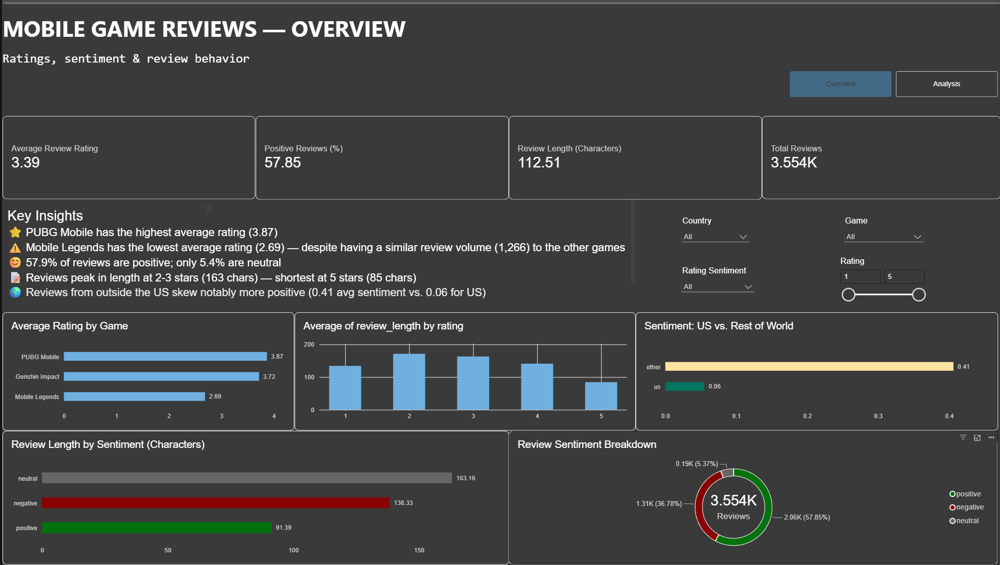
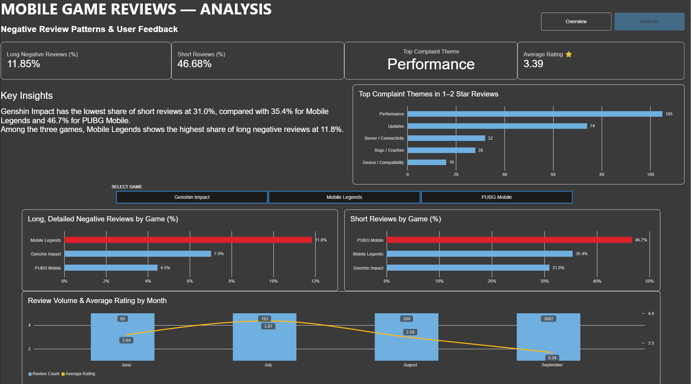

# Mobile Game Review Analysis

## Project Overview

This project analyzes **3,554 Google Play Store reviews** from Genshin Impact, Mobile Legends, and PUBG Mobile using Python, PostgreSQL, SQL, and Power BI.

The workflow cleans messy multilingual review data, engineers analytical features, stores the processed data in PostgreSQL, performs SQL analysis, and presents the results in an interactive Power BI dashboard.

## Tools

- Python
- Pandas
- PostgreSQL
- SQLAlchemy
- SQL
- Power BI
- DAX

## Project Workflow

1. Load scraped Google Play Store review data
2. Clean and transform the data with Pandas
3. Handle missing translations and multilingual text
4. Create sentiment, review-length, translation, and locale features
5. Load the cleaned data into PostgreSQL
6. Analyze review behavior using SQL
7. Visualize the results in Power BI

## SQL Analysis

The project includes SQL queries for:

- Average rating by game
- Sentiment distribution
- Review length analysis
- Long negative review percentage
- Short review percentage
- Translation and locale comparisons
- Monthly review volume and rating trends
- Game ranking using window functions
- Game metadata analysis using JOIN
- Multi-label complaint-theme analysis

## Dashboard

### Overview

### Analysis

## Key Findings

- **57.9%** of reviews are positive, **36.8%** negative, and **5.4%** neutral.
- The overall average rating is **3.39 / 5**.
- Mobile Legends has the lowest average rating at **2.69**, compared with **3.72** for Genshin Impact and **3.87** for PUBG Mobile.
- Review length is highest around 2–3 star ratings, suggesting users provide more detail when their experience is mixed.
- Mobile Legends has a higher proportion of long negative reviews than PUBG Mobile.
- Translated reviews received a higher average rating than English reviews.
- Reviews where the review language matches the app UI language received higher ratings than locale-mismatched reviews.
- The main complaint themes among 1–2 star reviews include **Updates, Performance, Server / Connectivity, Bugs / Crashes, and Device / Compatibility**.
- Review volume is heavily concentrated in September, so monthly rating changes should be interpreted cautiously.

## Data Validation

Complaint-theme results were cross-checked between SQL and Power BI.

The initial difference was traced to the analyses using different review-text columns. After aligning the text source, filters, keywords, and multi-label logic, the results were reconciled.

## Data Cleaning

The dataset contains real-world data-quality challenges including:

- Missing translations
- Multilingual reviews
- Inconsistent locale values
- Country and language differences
- Uneven review volume across months

Instead of removing reviews with missing translations, the pipeline preserves their rating and metadata so they remain available for analysis.

## Security

The PostgreSQL password is stored in an environment variable.

The real `.env` file is excluded from version control.
